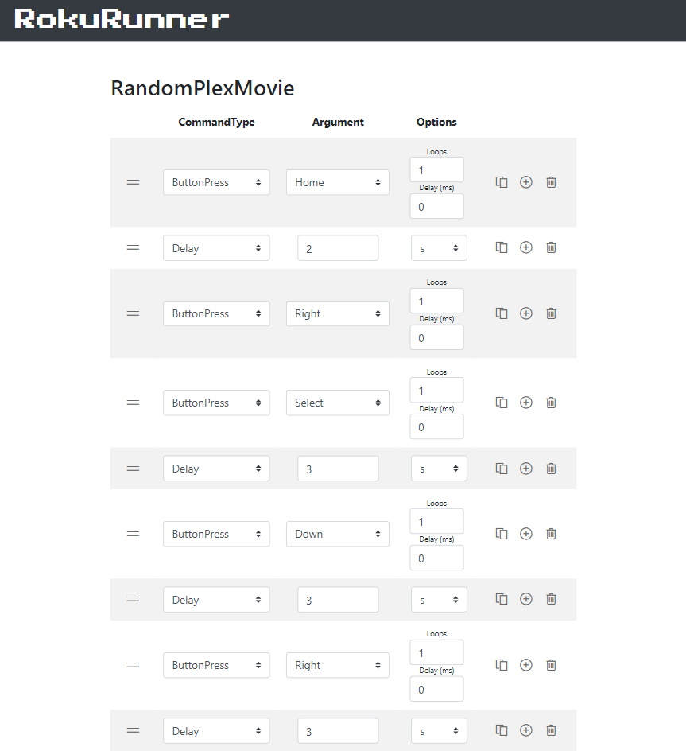

# rokurunner

RokuRunner is a webapp for easily automating Roku remote keypresses (and more)
 
 - Simple and responsive interface built with [Flask](https://flask.palletsprojects.com/) and [Vue.js](https://vuejs.org/)
 - Automatic Roku device discovery
 - Create HTTP endpoints to run button press scripts (Runners)
 - Custom actions (HTTPRequest) to invoke other actions (like IOT devices, etc)
 
 ## Use cases

 *Simple:*
 
 - Launch a channel (other than the ones built into your remote)
 - Launch a channel and automatically select some specific or random content
 - Set a sleep timer (if your Roku device supports power-off via remote)
 - more to come

*Advanced:*

 - Hook up generated endpoints to other automated services (e.g. Google Home, Alexa, etc.)
 - Hook up generated endpoints to IOT devices (e.g. IR bridge, lights, etc.)
 

Main interface       |  Runner editor
:-------------------------:|:-------------------------:
  |  

## Installation

Use [pipenv](https://pipenv.pypa.io/) to install dependencies

    pipenv install

Then run
    
    pipenv run rokurunner
    
This will start RokuRunner server on port 8900. 

## Usage

Visit http://localhost:8900 which presents you with the main interface.

### Main interface

  - Roku Devices
    - Add your Roku devices here by their IP address. Clicking `Manual Add` will let you enter the IP address manually
    - Clicking Auto Search will search for Roku devices on your network, and display them by IP address and UUID. Press the + button to add a discovered Roku to the Roku Devices list, update the name, then `Save Changes`.
 
  - Runners
    - These are the automated scripts you can build. To add, click `Add`, enter a name, and click `Save Changes`
    - To edit the Runner, click the notepad icon beside it (see next section)
    
  - RokuRunner Endpoints
    - A place to build endpoints (links) you can access (`curl` or just goto the URL in your browser) to run your Runner on a specific Roku Device
    - The play button will open and run the endpoint, the copy button will copy the endpoint URL
    

### Runner builder/editor 

  - Create your Runner (script) here. Click `Add` to add a first command. To add more, click the + button to the right of the command to insert a new one.
  - To reorder commands, drag the grip on the left of the command
  
  Command Types:
  - ButtonPress
    - Set ButtonPress type in the argument dropdown. Note: All button types are exposed, but some Roku devices don't support certain button press types (e.g. PowerOn, PowerOff, InputHMDI1, etc)
  - Delay
    - Set a delay (ms) in the argument field
  - HTTPRequest
    - Performs a `POST` request (no data) to the endpoint entered in the argument field.
  - SendCharacter
    - Sends a character (literal) to the RokuDevice (e.g. when the keyboard on the Roku is open)
      
      
## Development

  - Shout out the the original inspiration for this, my Grandma, who I built this for to be able to tune to her favorite international streaming channel with one remote button press
  - Thanks to [python-roku](https://github.com/jcarbaugh/python-roku) for the inspiration and [Dan Krause](https://github.com/dankrause) for his [SSDP code](https://gist.github.com/dankrause/6000248) (I had to modify the gist, it won't work with multiple local network interfaces, solved by binding the socket to the local address)
  - My first webapp with a 'modern' front-end framework. I really appreciate being able to using VueJs 'single-page style' without having to install a gigantic build environment ([cough](https://hackernoon.com/how-it-feels-to-learn-javascript-in-2016-d3a717dd577f))
  
## Limitations

  - An inherent limitation is the "open-loop" system style of commands received by the Roku. There is no guarantee the command was executed, nor any way to check whether an channel has launched. Usually though if you provide a sufficient delay the runners should be fairly repeatable.
  - Currently when visiting the endpoint via web browser, there is no indication of runner progress. This might be a todo feature if the need arises.
  
## TODO
  
  - Update python executor to prevent launching multiple runners on same device
  - Add seconds option to to delay (currently milliseconds only)
  - Add a random move command, with max random limit
  - Incorporate a MQTT client to subscribe to topics and run endpoints (IOT stuff)
      
      
      
